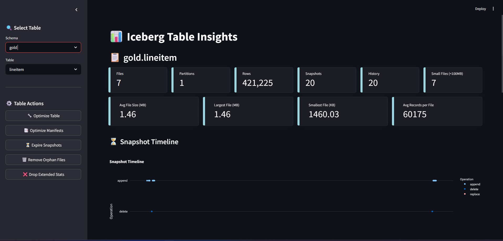

# Iceberg Metadata Insights

Iceberg Metadata Insights is a Streamlit-based application designed to provide comprehensive insights into Apache Iceberg table metadata. It allows users to analyze, optimize, and explore Iceberg table statistics, snapshots, file details, and more.

# Demo

See demo video on LinkedIn: [Iceberg Metadata Insights Demo](https://www.linkedin.com/posts/isainalcik_opensource-apacheiceberg-trino-activity-7313174195268444160-Dn3L?utm_source=share&utm_medium=member_desktop&rcm=ACoAAAy1qYIBiVCMD34GF_PLP6AL-kOpMZ8AWCA)

[](https://www.linkedin.com/posts/isainalcik_opensource-apacheiceberg-trino-activity-7313174195268444160-Dn3L?utm_source=share&utm_medium=member_desktop&rcm=ACoAAAy1qYIBiVCMD34GF_PLP6AL-kOpMZ8AWCA)

## Features

- **Table Overview**: View key statistics such as file counts, partition counts, row counts, and file size metrics.
- **Snapshot Timeline**: Visualize snapshot history with detailed operation data.
- **File Size Distribution**: Analyze file size distribution with histograms.
- **Table Actions**: Perform operations like table analysis, optimization, snapshot expiration, and orphan file removal.
- **Detailed Metadata**: Explore table DDL, properties, history, manifests, partitions, files, and more.

## Prerequisites

- Python 3.8 or higher
- Required Python libraries:
  - `streamlit`
  - `trino`
  - `pandas`
  - `plotly`
  - `streamlit-extras`
- Required environment
  - Running Trino Server with Iceberg connector
  - Hive Metastore
  - Existing iceberg tables

## Installation

Create .env file in the root directory and add your Trino connection details:

```bash
TRINO_HOST=your_trino_host
TRINO_PORT=your_trino_port
TRINO_USER=your_trino_user
TRINO_CATALOG=your_trino_catalog
TRINO_SCHEMA=your_trino_schema
TRINO_HTTP_SCHEME=http
```

## Docker

To run the application in a Docker container, you can use the provided Dockerfile. This allows for easy deployment and isolation of dependencies.

### Build the Docker Image

```bash
docker build -t iceberg-metadata-insights .
```

### Run the Docker Container

```bash
docker run -p 8501:8501 -e TRINO_HOST=your_trino_host -e TRINO_PORT=your_trino_port -e TRINO_USER=your_trino_user iceberg-metadata-insights
```

## How to Run

1. Clone the repository:

   ```bash
   git clone https://github.com/alaturqua/iceberg-metadata-insights.git
   cd iceberg-metadata-insights
   ```

   Install the required Python libraries:

   ```bash
   python -m venv .venv
   source .venv/bin/activate  # On Windows use `.venv\Scripts\activate`
   pip install .
   ```

2. Start the Streamlit app:

   ```bash
   streamlit run ./src/app.py
   ```

3. Open the app in your browser at `http://localhost:8501`.

## Usage

1. Select a schema and table from the sidebar.
2. View table statistics, snapshot timelines, and file size distributions.
3. Perform table actions like optimization, snapshot expiration, and more.
4. Explore detailed metadata through various tabs.

## License

This project is licensed under the GNU GPLv3 License. See the [LICENSE](LICENSE) file for details.

## Acknowledgments

- [Apache Iceberg](https://iceberg.apache.org/)
- [Streamlit](https://streamlit.io/)
- [Trino](https://trino.io/)

## Contributing

Contributions are welcome! If you have suggestions or improvements, please open an issue or submit a pull request.
